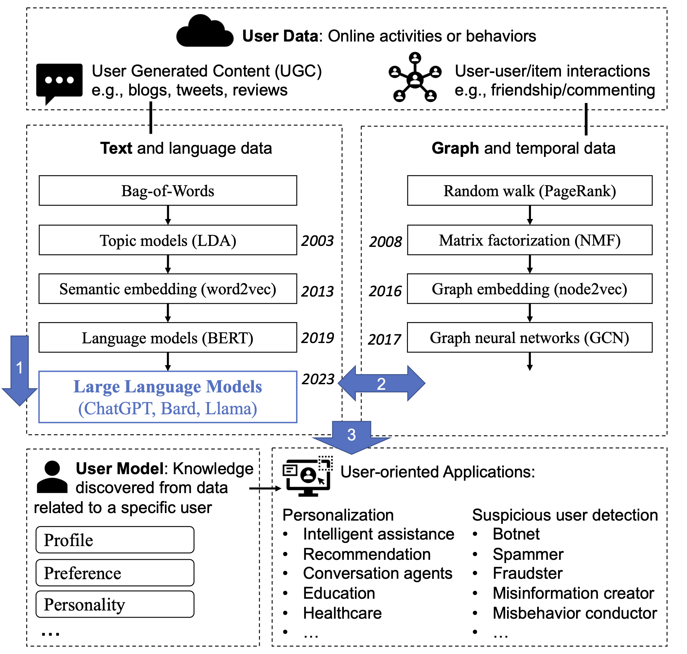
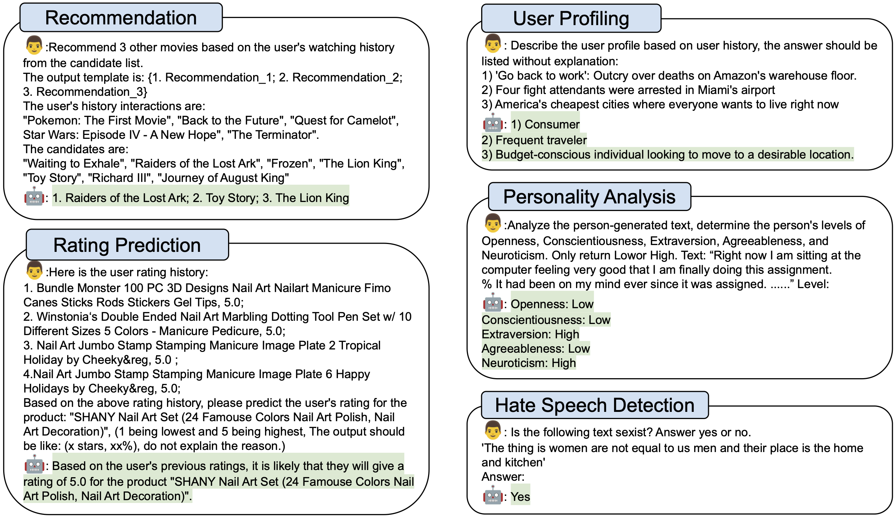
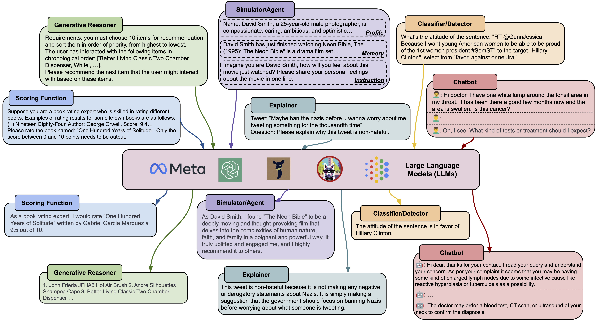
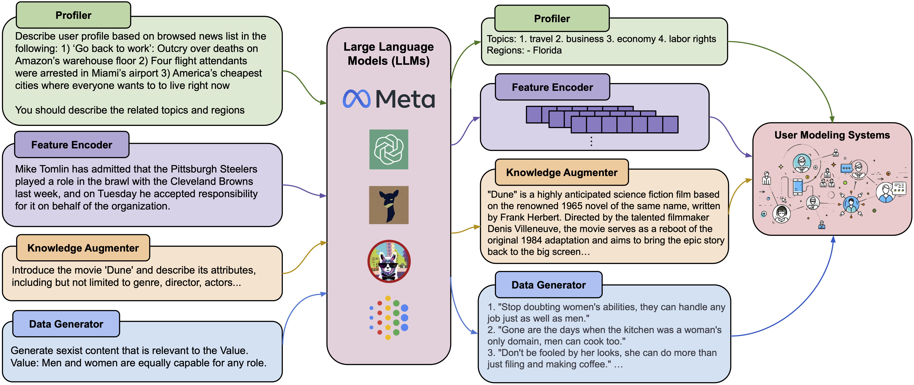
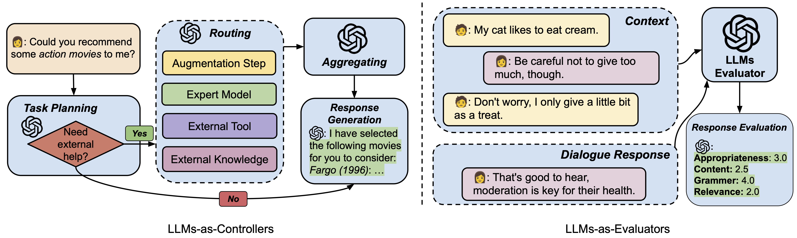

# Large Language Models for User Modeling (LLM-UM) Reading List
  [](https://awesome.re) 


This repository contains a list of papers on large language models for user modeling (LLM-UM) based on our survey paper: [**User Modeling in the Era of Large Language Models: Current Research and Future Directions**](https://arxiv.org/abs/2312.11518) (*[Zhaoxuan Tan](https://zhaoxuan.info/) and [Meng Jiang](http://www.meng-jiang.com/)*).
We categorize existing works based on their approaches and applications.

We will try to make this list updated. If you find any error or any missed paper, please don't hesitate to open an issue or pull request.

<div  align="center">    

</div>


## Motivation: Why LLMs for User Modeling?

<div  align="center">    

</div>

LLMs have shown promising potential in modeling and comprehending user-generated content (UGC), as evidenced by various studies and examples. One area of focus is utilizing LLMs for recommendation purposes, where they can predict users' item-based interests based on their behavior history. User profiling is another domain where LLMs excel, summarizing users' characteristics and interests from their generated content and history. In the context of rating prediction, LLMs can leverage reasoning based on users' previous ratings to predict ratings for candidate items. Additionally, LLMs demonstrate the ability to understand user personality and recognize it based on UGC history. They also prove effective in detecting suspicious UGC, such as hate speech. These findings collectively illustrate the capabilities of LLMs in modeling, understanding, and reasoning UGC and user behavior, making them valuable tools for user-oriented applications.

## Approaches to LLM-UM

### LLMs as Predictors

<div  align="center">    

</div>

#### Common Generative Reasoner

- **Recommendation as Instruction Following: A Large Language Model Empowered Recommendation Approach [[link]](https://arxiv.org/abs/2305.07001)**
    
    
- **Is ChatGPT a Good Recommender? A Preliminary Study [[link]](https://arxiv.org/abs/2304.10149)**
    
    
- **Zero-Shot Next-Item Recommendation using Large Pretrained Language Models [[link]](https://arxiv.org/abs/2304.03153)**
    
    
- **Large Language Models for User Interest Journeys [[link]](https://arxiv.org/abs/2305.15498)**
    
    
- **Large Language Models are Competitive Near Cold-start Recommenders for Language- and Item-based Preferences [[link]](https://arxiv.org/pdf/2307.14225.pdf)**
    
    
- **BookGPT: A General Framework for Book Recommendation Empowered by Large Language Model [[link]](https://arxiv.org/abs/2305.15673)**
    
    
- **Large Language Models are Zero-Shot Rankers for Recommender Systems [[link]](https://arxiv.org/abs/2305.08845)**
    
    
- **PALR: Personalization Aware LLMs for Recommendation [[link]](https://arxiv.org/abs/2305.07622)**
    
    
- **LaMP: When Large Language Models Meet Personalization [[link]](https://arxiv.org/pdf/2304.11406.pdf)**
    
    
- **Teach LLMs to Personalize -- An Approach inspired by Writing Education [[link]](https://arxiv.org/abs/2308.07968)**
    
    
- **A Preliminary Study of ChatGPT on News Recommendation: Personalization, Provider Fairness, Fake News [[link]](https://arxiv.org/abs/2306.10702)**
    
    
- **ReLLa: Retrieval-enhanced Large Language Models for Lifelong Sequential Behavior Comprehension in Recommendation [[link]](https://arxiv.org/pdf/2308.11131.pdf)**
    
    
- **Is ChatGPT a Good Personality Recognizer? A Preliminary Study [[link]](https://arxiv.org/abs/2307.03952)**

- **Can ChatGPT Assess Human Personalities? A General Evaluation Framework [[link]](https://arxiv.org/abs/2303.01248)**

- **Uncovering the Potential of ChatGPT for Discourse Analysis in Dialogue: An Empirical Study [[link]](https://arxiv.org/abs/2305.08391)**


- **Large language models can accurately predict searcher preferences [[link]](https://arxiv.org/abs/2309.10621)**
    
    
- **An External Stability Audit Framework to Test the Validity of Personality Prediction in AI Hiring [[link]](https://arxiv.org/abs/2201.09151)**
            
- **Multilevel Large Language Models for Everyone [[link]](https://arxiv.org/abs/2307.13221)**

- **Evaluating ChatGPT as a Recommender System: A Rigorous Approach [[link]](https://arxiv.org/abs/2309.03613)**

- **ChatGPT for Suicide Risk Assessment on Social Media: Quantitative Evaluation of Model Performance, Potentials and Limitations [[link]](https://arxiv.org/abs/2306.09390)**

- **Recommendation as Instruction Following: A Large Language Model Empowered Recommendation Approach [[link]](https://arxiv.org/abs/2305.07001)**


- **Generative Job Recommendations with Large Language Model [[link]](https://arxiv.org/abs/2307.02157)**

- **TALLRec: An Effective and Efficient Tuning Framework to Align Large Language Model with Recommendation [[link]](https://arxiv.org/abs/2305.00447)**

- **Exploring Large Language Model for Graph Data Understanding in Online Job Recommendations [[link]](https://arxiv.org/pdf/2307.05722.pdf)**
    
- **Automatic Personalized Impression Generation for PET Reports Using Large Language Models [[link]](https://arxiv.org/abs/2309.10066)**


- **ReLLa: Retrieval-enhanced Large Language Models for Lifelong Sequential Behavior Comprehension in Recommendation [[link]](https://arxiv.org/abs/2308.11131)**


#### Simulator/Agent
- **Leveraging Large Language Models in Conversational Recommender Systems [[link]](https://arxiv.org/abs/2305.07961)**
        
        
- **RecMind: Large Language Model Powered Agent For Recommendation [[link]](https://arxiv.org/abs/2308.14296)**
    
    
- **Recommender AI Agent: Integrating Large Language Models for Interactive Recommendations [[link]](https://arxiv.org/abs/2308.16505)**
    
    
- **When Large Language Model based Agent Meets User Behavior Analysis: A Novel User Simulation Paradigm [[link]](https://arxiv.org/abs/2306.02552)**
    
    
- **Unlocking the Potential of User Feedback: Leveraging Large Language Model as User Simulator to Enhance Dialogue System [[link]](https://arxiv.org/abs/2306.09821)**
    
    
- **Large Language Model as a User Simulator [[link]](https://arxiv.org/abs/2308.11534)**
    
    
- **Graph-ToolFormer: To Empower LLMs with Graph Reasoning Ability via Prompt Augmented by ChatGPT [[link]](https://arxiv.org/abs/2304.11116)**
    
    
- **Auto-GPT [[link]](https://github.com/Significant-Gravitas/Auto-GPT)**
    

- **A Study on the Performance of Generative Pre-trained Transformer (GPT) in Simulating Depressed Individuals on the Standardized Depressive Symptom Scale [[link]](https://arxiv.org/abs/2307.08576)**

- **Generative Agents: Interactive Simulacra of Human Behavior [[link]](https://arxiv.org/abs/2304.03442)**

- **PersonaLLM: Investigating the Ability of Large Language Models to Express Big Five Personality Traits [[link]](https://arxiv.org/abs/2305.02547)**

- **When Large Language Model based Agent Meets User Behavior Analysis: A Novel User Simulation Paradigm [[link]](https://arxiv.org/abs/2306.02552)**


#### Classifier/Detector

- **How would Stance Detection Techniques Evolve after the Launch of ChatGPT? [[link]](https://arxiv.org/abs/2212.14548)**
        
        
- **Ladder-of-Thought: Using Knowledge as Steps to Elevate Stance Detection [[link]](https://arxiv.org/abs/2308.16763)**

- **Leveraging Large Language Models for Topic Classification in the Domain of Public Affairs [[link]](https://arxiv.org/abs/2306.02864)**
    
    
- **Text Classification via Large Language Models [[link]](https://arxiv.org/abs/2305.08377)**
    
    
- **Navigating Prompt Complexity for Zero-Shot Classification: A Study of Large Language Models in Computational Social Science [[link]](https://arxiv.org/abs/2305.14310)**
    
    
- **Exploring Zero and Few-shot Techniques for Intent Classification [[link]](https://arxiv.org/pdf/2305.07157.pdf)**
    
    
- **Enabling Classifiers to Make Judgements Explicitly Aligned with Human Values [[link]](https://arxiv.org/pdf/2210.07652.pdf)**
- **Large Language Models in the Workplace: A Case Study on Prompt Engineering for Job Type Classification [[link]](https://arxiv.org/abs/2303.07142)**
    
    
- **How to use LLMs for Text Analysis [[link]](https://arxiv.org/abs/2307.13106)**
    
    
- **Stance Detection With Supervised, Zero-Shot, and Few-Shot Applications [[link]](https://arxiv.org/abs/2305.01723)**

- **TabLLM: Few-shot Classification of Tabular Data with Large Language Models [[link]](https://arxiv.org/abs/2210.10723)**
    
    
- **Read, Diagnose and Chat: Towards Explainable and Interactive LLMs-Augmented Depression Detection in Social Media [[link]](https://arxiv.org/abs/2305.05138)**
    
    
- **What do LLMs Know about Financial Markets? A Case Study on Reddit Market Sentiment Analysis [[link]](https://arxiv.org/pdf/2212.11311.pdf)**
    
    
- **Social bot detection in the age of ChatGPT: Challenges and opportunities [[link]](https://firstmonday.org/ojs/index.php/fm/article/view/13185)**
    
    
- **Exploring Self-Reinforcement for Improving Learnersourced Multiple-Choice Question Explanations with Large Language Models [[link]](https://arxiv.org/abs/2309.10444)**

- **Leveraging Large Language Models for Automated Dialogue Analysis [[link]](https://arxiv.org/abs/2309.06490)**
    
- **Evaluating the Efficacy of Supervised Learning vs Large Language Models for Identifying Cognitive Distortions and Suicidal Risks in Chinese Social Media [[link]](https://arxiv.org/abs/2309.03564)**
    
    
- **Clickbait Detection via Large Language Models [[link]](https://arxiv.org/abs/2306.09597)**

- **Fine-Tuning Llama 2 Large Language Models for Detecting Online Sexual Predatory Chats and Abusive Texts [[link]](https://arxiv.org/abs/2308.14683)**

- **Breaking the Bank with ChatGPT: Few-Shot Text Classification for Finance [[link]](https://arxiv.org/abs/2308.14634)**

- **SentimentGPT: Exploiting GPT for Advanced Sentiment Analysis and its Departure from Current Machine Learning [[link]](https://arxiv.org/abs/2307.10234)**

- **Detecting Hate Speech with GPT-3 [[link]](https://arxiv.org/abs/2103.12407)**

- **Can Large Language Models Transform Computational Social Science? [[link]](https://arxiv.org/abs/2305.03514)**

- **Balanced and Explainable Social Media Analysis for Public Health with Large Language Models [[link]](https://link.springer.com/chapter/10.1007/978-3-031-47843-7_6)**

- **Fighting Fire with Fire: Can ChatGPT Detect AI-generated Text? [[link]](https://arxiv.org/abs/2308.01284)**

#### Scoring Function

 - **Leveraging Large Language Models in Conversational Recommender Systems [[link]](https://arxiv.org/abs/2305.07961)**
            
- **Large Language Models for User Interest Journeys [[link]](https://arxiv.org/abs/2305.15498)**

- **Chat-REC: Towards Interactive and Explainable LLMs-Augmented Recommender System [[link]](https://arxiv.org/pdf/2303.14524.pdf)**
    
    
- **Do LLMs Understand User Preferences? Evaluating LLMs On User Rating Prediction [[pdf]](https://arxiv.org/abs/2305.06474)**
    
    
- **BookGPT: A General Framework for Book Recommendation Empowered by Large Language Model [[link]](https://arxiv.org/abs/2305.15673)**
    
    
- **Is ChatGPT a Good Recommender? A Preliminary Study [[link]](https://arxiv.org/abs/2304.10149)**
    
    
- **TALLRec: An Effective and Efficient Tuning Framework to Align Large Language Model with Recommendation [[link]](https://arxiv.org/abs/2305.00447)**
    
    
- **Uncovering ChatGPT's Capabilities in Recommender Systems [[link]](https://arxiv.org/abs/2305.02182)**
    
    
- **Graph-ToolFormer: To Empower LLMs with Graph Reasoning Ability via Prompt Augmented by ChatGPT [[link](https://arxiv.org/abs/2304.11116)]**
    
    
- **Towards Open-World Recommendation with Knowledge Augmentation from Large Language Models [[link]](https://arxiv.org/abs/2306.10933)**

- **Unlocking the Potential of User Feedback: Leveraging Large Language Model as User Simulator to Enhance Dialogue System [[link]](https://arxiv.org/abs/2306.09821)**
        
#### Explainer
- **Is ChatGPT a Good Recommender? A Preliminary Study [[link]](https://arxiv.org/abs/2304.10149)**
    
- **Chat-REC: Towards Interactive and Explainable LLMs-Augmented Recommender System [[link]](https://arxiv.org/abs/2303.14524)**
    
- **Teach LLMs to Personalize -- An Approach inspired by Writing Education [[link]](https://arxiv.org/abs/2308.07968)**
    
    
- **Personalised Language Modelling of Screen Characters Using Rich Metadata Annotations [[link]](https://www.notion.so/Explanations-as-Features-LLM-Based-Features-for-Text-Attributed-Graphs-c64f1bface554df1afd6bf3ee6738521?pvs=21)**
    
    
- **Temporal Data Meets LLM -- Explainable Financial Time Series Forecasting [[link]](https://arxiv.org/abs/2306.11025)**
    
    
- **Explaining Agent Behavior with Large Language Models [[link]](https://arxiv.org/abs/2309.10346)**
    
    
- **Balanced and Explainable Social Media Analysis for Public Health with Large Language Models [[link]](https://arxiv.org/abs/2309.05951)**
            
- **Generate Neural Template Explanations for Recommendation [[link]](https://dl.acm.org/doi/10.1145/3340531.3411992)**
- **Personalized Prompt Learning for Explainable Recommendation [[link]](https://arxiv.org/abs/2202.07371)**
    
    
- **Generating medically-accurate summaries of patient-provider dialogue: A multi-stage approach using large language models [[link]](https://arxiv.org/abs/2305.05982)**

- **Exploring Self-Reinforcement for Improving Learnersourced Multiple-Choice Question Explanations with Large Language Models [[link]](https://arxiv.org/abs/2309.10444)**

- **LLMs as Counterfactual Explanation Modules: Can ChatGPT Explain Black-box Text Classifiers? [[link]](https://arxiv.org/abs/2309.13340)**

- **Evaluating GPT-3 Generated Explanations for Hateful Content Moderation [[link]](https://arxiv.org/abs/2305.17680)**

- **Can Large Language Models Transform Computational Social Science? [[link]](https://arxiv.org/abs/2305.03514)**


#### Chatbot

- **Chat-REC: Towards Interactive and Explainable LLMs-Augmented Recommender System [[link]](https://arxiv.org/pdf/2303.14524.pdf)**
        
        
- **Sparks of Artificial General Recommender (AGR): Early Experiments with ChatGPT [[link]](https://arxiv.org/abs/2305.04518)**
    
    
- **Read, Diagnose and Chat: Towards Explainable and Interactive LLMs-Augmented Depression Detection in Social Media [[link]](https://arxiv.org/abs/2305.05138)**
    
    
- **PersonaLLM: Investigating the Ability of GPT-3.5 to Express Personality Traits and Gender Differences [[link]](https://arxiv.org/abs/2305.02547)**
    
    
- **Can LLMs be Good Financial Advisors?: An Initial Study in Personal Decision Making for Optimized Outcomes [[link]](https://arxiv.org/abs/2307.07422)**
    
    
- **ChatGPT as your Personal Data Scientist [[link]](https://arxiv.org/pdf/2305.13657.pdf)**
    
    
- **CharacterChat: Learning towards Conversational AI with Personalized Social Support [[link]](https://arxiv.org/abs/2308.10278)**
    
    
- **Building Emotional Support Chatbots in the Era of LLMs [[link]](https://arxiv.org/abs/2308.11584)**
    
    
- **Large Language Models as Zero-Shot Conversational Recommenders [[link]](https://arxiv.org/abs/2308.10053)**
    
    
- **Building a Role Specified Open-Domain Dialogue System Leveraging Large-Scale Language Models [[link]](https://arxiv.org/abs/2205.00176)**

- **ChatDoctor: A Medical Chat Model Fine-Tuned on a Large Language Model Meta-AI (LLaMA) Using Medical Domain Knowledge [[link]](https://arxiv.org/abs/2303.14070)**

- **LLM-empowered Chatbots for Psychiatrist and Patient Simulation: Application and Evaluation [[link]](https://arxiv.org/abs/2305.13614)**

- **Generative Recommendation: Towards Next-generation Recommender Paradigm [[link]](https://arxiv.org/abs/2304.03516)**

### LLMs as Enhancer

#### Profiler
- **GENRE - A First Look at LLM-Powered Generative News Recommendation [[link]](https://arxiv.org/abs/2305.06566)**
    
    
- **ONCE: Boosting Content-based Recommendation with Both Open- and Closed-source Large Language Models [[link]](https://arxiv.org/abs/2305.06566)**
    
    
- **Heterogeneous Knowledge Fusion: A Novel Approach for Personalized Recommendation via LLM [[link]](https://arxiv.org/pdf/2308.03333.pdf)**
    
    
- **PALR: Personalization Aware LLMs for Recommendation [[link]](https://arxiv.org/abs/2305.07622)**
    
    
- **Towards Open-World Recommendation with Knowledge Augmentation from Large Language Models [[link]](https://arxiv.org/pdf/2306.10933.pdf)**
    
    
- **Enhancing Job Recommendation through LLM-based Generative Adversarial Networks [[link]](https://arxiv.org/abs/2307.10747)**

- **Heterogeneous Knowledge Fusion: A Novel Approach for Personalized Recommendation via LLM [[link]](https://arxiv.org/abs/2308.03333)**

- **Generative Job Recommendations with Large Language Model [[link]](https://arxiv.org/abs/2307.02157)**

- **Zero-Shot Next-Item Recommendation using Large Pretrained Language Models [[link]](https://arxiv.org/abs/2304.03153)**


#### Feature Encoder

<div  align="center">    

</div>

- **Are GPT Embeddings Useful for Ads and Recommendation? [[link]](https://dl.acm.org/doi/abs/10.1007/978-3-031-40292-0_13)**
        
        
- **LKPNR: LLM and KG for Personalized News Recommendation Framework [[link]](https://arxiv.org/abs/2308.12028)**
        
        
- **Exploring the Upper Limits of Text-Based Collaborative Filtering Using Large Language Models: Discoveries and Insights [[link]](https://arxiv.org/abs/2305.11700)**
                
- **LLM4Jobs: Unsupervised occupation extraction and standardization leveraging Large Language Models [[link]](https://arxiv.org/abs/2309.09708)**
                
- **Prompt Tuning Large Language Models on Personalized Aspect Extraction for Recommendations [[link]](https://arxiv.org/pdf/2306.01475.pdf)**

- **SentimentGPT: Exploiting GPT for Advanced Sentiment Analysis and its Departure from Current Machine Learning [[link]](https://arxiv.org/abs/2307.10234)**

- **Towards Open-World Recommendation with Knowledge Augmentation from Large Language Models [[link]](https://arxiv.org/abs/2306.10933)**


#### Knowledge Augmenter

- **Are GPT Embeddings Useful for Ads and Recommendation? [[link]](https://dl.acm.org/doi/abs/10.1007/978-3-031-40292-0_13)**
        
        
- **Heterogeneous Knowledge Fusion: A Novel Approach for Personalized Recommendation via LLM [[link]](https://arxiv.org/pdf/2308.03333.pdf)**
    
    
- **Large Language Model Augmented Narrative Driven Recommendations [[link]](https://arxiv.org/abs/2306.02250)**
    
    
- **Towards Open-World Recommendation with Knowledge Augmentation from Large Language Models [[link]](https://arxiv.org/pdf/2306.10933.pdf)**
    
    
- **Heterogeneous Knowledge Fusion: A Novel Approach for Personalized Recommendation via LLM [[link]](https://arxiv.org/pdf/2308.03333.pdf)**
    
    
- **GPT4Rec: A Generative Framework for Personalized Recommendation and User Interests Interpretation [[link]](https://arxiv.org/pdf/2304.03879.pdf)**
    
    
- **AugESC: Dialogue Augmentation with Large Language Models for Emotional Support Conversation [[link]](https://arxiv.org/abs/2202.13047)**
    
    
- **LLM-Rec: Personalized Recommendation via Prompting Large Language Models [[link]](https://arxiv.org/abs/2307.15780)**
    
    
- **LLM Based Generation of Item-Description for Recommendation System [[link]](https://dl.acm.org/doi/pdf/10.1145/3604915.3610647)**

- **Prompt Tuning Large Language Models on Personalized Aspect Extraction for Recommendations [[link]](https://arxiv.org/abs/2306.01475)**

- **ChatGPT as Data Augmentation for Compositional Generalization: A Case Study in Open Intent Detection [[link]](https://arxiv.org/abs/2308.13517)**

- **PULSAR: Pre-training with Extracted Healthcare Terms for Summarising Patients' Problems and Data Augmentation with Black-box Large Language Models [[link]](https://arxiv.org/abs/2306.02754)**

- **PULSAR at MEDIQA-Sum 2023: Large Language Models Augmented by Synthetic Dialogue Convert Patient Dialogues to Medical Records [[link]](https://arxiv.org/abs/2307.02006)**

- **Enhancing social network hate detection using back translation and GPT-3 augmentations during training and test-time [[link]](https://www.sciencedirect.com/science/article/pii/S1566253523002038)**

- **Roll Up Your Sleeves: Working with a Collaborative and Engaging Task-Oriented Dialogue System [[link]](https://arxiv.org/abs/2307.16081)**

- **Large Language Models for Healthcare Data Augmentation: An Example on Patient-Trial Matching [[link]](https://arxiv.org/abs/2303.16756)**


#### Data Generator

- **Enabling Classifiers to Make Judgements Explicitly Aligned with Human Values [[link]](https://arxiv.org/pdf/2210.07652.pdf)**
    
    
- **Generating Efficient Training Data via LLM-based Attribute Manipulation [[link]](https://arxiv.org/pdf/2307.07099.pdf)**
    
    
- **Language Models are Realistic Tabular Data Generators [[link]](https://arxiv.org/abs/2210.06280)**
    
    
- **Does Synthetic Data Generation of LLMs Help Clinical Text Mining? [[link]](https://arxiv.org/abs/2303.04360)**
    
    
- **Prompt2Model: Generating Deployable Models from Natural Language Instructions [[link]](https://arxiv.org/abs/2308.12261)**
    
    
- **Fabricator: An Open Source Toolkit for Generating Labeled Training Data with Teacher LLMs [[link]](https://arxiv.org/abs/2309.09582)**
    
    
- **Building Emotional Support Chatbots in the Era of LLMs [[link]](https://arxiv.org/pdf/2308.11584.pdf)**
    
    
- **UMASS_BioNLP at MEDIQA-Chat 2023: Can LLMs generate high-quality synthetic note-oriented doctor-patient conversations? [[link]](https://arxiv.org/abs/2306.16931)**
    
    
- **ChatGPT as Data Augmentation for Compositional Generalization: A Case Study in Open Intent Detection [[link]](https://arxiv.org/abs/2308.13517)**
    
    
- **PULSAR at MEDIQA-Sum 2023: Large Language Models Augmented by Synthetic Dialogue Convert Patient Dialogues to Medical Records [[link]](https://arxiv.org/pdf/2307.02006.pdf)**
    
    
- **LLM4Jobs: Unsupervised occupation extraction and standardization leveraging Large Language Models [[link]](https://arxiv.org/abs/2309.09708)**
    
    
- **Fake News Detectors are Biased against Texts Generated by Large Language Models [[link]](https://arxiv.org/abs/2309.08674)**

- **Generating Faithful Synthetic Data with Large Language Models: A Case Study in Computational Social Science [[link]](https://arxiv.org/abs/2305.15041)**

- **Exploring the Potential of AI-Generated Synthetic Datasets: A Case Study on Telematics Data with ChatGPT [[link]](https://arxiv.org/abs/2306.13700)**

- **PULSAR: Pre-training with Extracted Healthcare Terms for Summarising Patients' Problems and Data Augmentation with Black-box Large Language Models [[link]](https://arxiv.org/abs/2306.02754)**

- **Detecting Misinformation with LLM-Predicted Credibility Signals and Weak Supervision [[link]](https://arxiv.org/abs/2309.07601)**

- **What do LLMs Know about Financial Markets? A Case Study on Reddit Market Sentiment Analysis [[link]](https://arxiv.org/abs/2212.11311)**

- **Enhancing Pipeline-Based Conversational Agents with Large Language Models [[link]](https://arxiv.org/abs/2309.03748)**

- **Can LLM-Generated Misinformation Be Detected? [[link]](https://arxiv.org/abs/2309.13788)**

- **CoCo: Coherence-Enhanced Machine-Generated Text Detection Under Data Limitation With Contrastive Learning [[link]](https://arxiv.org/abs/2212.10341)**

- **GPT Paternity Test: GPT Generated Text Detection with GPT Genetic Inheritance [[link]](https://arxiv.org/abs/2305.12519)**

- **RefGPT: Dialogue Generation of GPT, by GPT, and for GPT [[link]](https://arxiv.org/abs/2305.14994)**


<div  align="center">    

</div>


### LLMs as Controllers

- **HuggingGPT: Solving AI Tasks with ChatGPT and its Friends in Hugging Face [[link]](https://arxiv.org/abs/2303.17580)**

- **Leveraging Large Language Models in Conversational Recommender Systems [[link]](https://arxiv.org/abs/2305.07961)**
    
- **Chat-REC: Towards Interactive and Explainable LLMs-Augmented Recommender System [[link]](https://arxiv.org/pdf/2303.14524.pdf)**
    
- **Enhancing Pipeline-Based Conversational Agents with Large Language Models [[link]](https://arxiv.org/abs/2309.03748)**
    
- **LLM4Jobs: Unsupervised occupation extraction and standardization leveraging Large Language Models [[link]](https://arxiv.org/abs/2309.09708)**
    
    
### LLMs as Evaluators    
    
- **Approximating Online Human Evaluation of Social Chatbots with Prompting [[link]](https://arxiv.org/abs/2304.05253)**
- **Rethinking the Evaluation for Conversational Recommendation in the Era of Large Language Models [[link]](https://arxiv.org/abs/2305.13112)**
        
- **Uncovering the Potential of ChatGPT for Discourse Analysis in Dialogue: An Empirical Study [[link]](https://arxiv.org/abs/2305.08391)**


- **Understanding the Effectiveness of Very Large Language Models on Dialog Evaluation [[link]](https://arxiv.org/abs/2301.12004)**

- **Judging LLM-as-a-judge with MT-Bench and Chatbot Arena [[link]](https://arxiv.org/abs/2306.05685)**

- **LLM-Eval: Unified Multi-Dimensional Automatic Evaluation for Open-Domain Conversations with Large Language Models [[link]](https://arxiv.org/abs/2305.13711)**

- **Towards Automated Generation and Evaluation of Questions in Educational Domains [[link]](https://www.cs.cmu.edu/~hn1/papers/EDM2022_TowardsAutomated.pdf)**

- **Generative Job Recommendations with Large Language Model [[link]](https://arxiv.org/abs/2307.02157)**

## Applications of LLM-UM

### Personalization
#### User Profiling

- **How would Stance Detection Techniques Evolve after the Launch of ChatGPT? [[link]](https://arxiv.org/abs/2212.14548)**

- **Ladder-of-Thought: Using Knowledge as Steps to Elevate Stance Detection [[link]](https://arxiv.org/abs/2308.16763)**

- **Navigating Prompt Complexity for Zero-Shot Classification: A Study of Large Language Models in Computational Social Science [[link]](https://arxiv.org/abs/2305.14310)**

- **Can Large Language Models Transform Computational Social Science? [[link]](https://arxiv.org/abs/2305.03514)**

- **SentimentGPT: Exploiting GPT for Advanced Sentiment Analysis and its Departure from Current Machine Learning [[link]](https://arxiv.org/abs/2307.10234)**

- **Large Language Models Can Be Used to Estimate the Latent Positions of Politicians [[link]](https://arxiv.org/abs/2303.12057)**

- **Can ChatGPT Assess Human Personalities? A General Evaluation Framework [[link]](https://arxiv.org/abs/2303.01248)**

- **Is ChatGPT a Good Personality Recognizer? A Preliminary Study [[link]](https://arxiv.org/abs/2307.03952)**

- **Large Language Models for User Interest Journeys [[link]](https://arxiv.org/abs/2305.15498)**


#### Personalized Recommendation

*Top-k Recommendation*

- **Uncovering ChatGPT's Capabilities in Recommender Systems [[link]](https://arxiv.org/abs/2305.02182)**

- **Enhancing Job Recommendation through LLM-based Generative Adversarial Networks [[link]](https://arxiv.org/abs/2307.10747)**

- **Large Language Models are Zero-Shot Rankers for Recommender Systems [[link]](https://arxiv.org/abs/2305.08845)**

- **Is ChatGPT a Good Recommender? A Preliminary Study [[link]](https://arxiv.org/abs/2304.10149)**

- **ONCE: Boosting Content-based Recommendation with Both Open- and Closed-source Large Language Models [[link]](https://arxiv.org/abs/2305.06566)**

- **Rethinking the Evaluation for Conversational Recommendation in the Era of Large Language Models [[link]](https://arxiv.org/abs/2305.13112)**

- **Is ChatGPT Fair for Recommendation? Evaluating Fairness in Large Language Model Recommendation [[link]](https://arxiv.org/abs/2305.07609)**


- **Recommendation as Instruction Following: A Large Language Model Empowered Recommendation Approach [[link]](https://arxiv.org/abs/2305.07001)**

- **PALR: Personalization Aware LLMs for Recommendation [[link]](https://arxiv.org/abs/2305.07622)**

- **GenRec: Large Language Model for Generative Recommendation [[link]](https://arxiv.org/abs/2307.00457)**

- **Generative Job Recommendations with Large Language Model [[link]](https://arxiv.org/abs/2307.02157)**

*Rating Prediction*

- **BookGPT: A General Framework for Book Recommendation Empowered by Large Language Model [[link]](https://arxiv.org/abs/2305.15673)**

- **Uncovering ChatGPT's Capabilities in Recommender Systems [[link]](https://arxiv.org/abs/2305.02182)**

- **Towards Open-World Recommendation with Knowledge Augmentation from Large Language Models [[link]](https://arxiv.org/abs/2306.10933)**

- **Do LLMs Understand User Preferences? Evaluating LLMs On User Rating Prediction [[link]](https://arxiv.org/abs/2305.06474)**

- **TALLRec: An Effective and Efficient Tuning Framework to Align Large Language Model with Recommendation [[link]](https://arxiv.org/abs/2305.00447)**

- **Exploring Large Language Model for Graph Data Understanding in Online Job Recommendations [[link]](https://arxiv.org/abs/2307.05722)**

- **Graph-ToolFormer: To Empower LLMs with Graph Reasoning Ability via Prompt Augmented by ChatGPT [[link]](https://arxiv.org/abs/2304.11116)**

*Conversational Recommendation*

- **Chat-REC: Towards Interactive and Explainable LLMs-Augmented Recommender System [[link]](https://arxiv.org/abs/2303.14524)**

- **Generative Recommendation: Towards Next-generation Recommender Paradigm [[link]](https://arxiv.org/abs/2304.03516)**

- **Sparks of Artificial General Recommender (AGR): Early Experiments with ChatGPT [[link]](https://arxiv.org/abs/2305.04518)**


#### Persoanlized Assistance

- **Is ChatGPT the Ultimate Programming Assistant -- How far is it? [[link]](https://arxiv.org/abs/2304.11938)**

- **Roll Up Your Sleeves: Working with a Collaborative and Engaging Task-Oriented Dialogue System [[link]](https://arxiv.org/abs/2307.16081)**

- **LaMP: When Large Language Models Meet Personalization [[link]](https://arxiv.org/abs/2304.11406)**

- **DISC-LawLLM: Fine-tuning Large Language Models for Intelligent Legal Services [[link]](https://arxiv.org/abs/2309.11325)**

- **FinGPT: Democratizing Internet-scale Data for Financial Large Language Models [[link]](https://arxiv.org/abs/2307.10485)**

- **Creativity Support in the Age of Large Language Models: An Empirical Study Involving Emerging Writers [[link]](https://arxiv.org/abs/2309.12570)**


#### Personalized Dialogue System

- **Are LLMs All You Need for Task-Oriented Dialogue? [[link]](https://arxiv.org/abs/2304.06556v2)**

- **DiagGPT: An LLM-based Chatbot with Automatic Topic Management for Task-Oriented Dialogue [[link]](https://arxiv.org/abs/2308.08043)**

- **A Personalized Dialogue Generator with Implicit User Persona Detection [[link]](https://arxiv.org/abs/2204.07372)**

- **RefGPT: Dialogue Generation of GPT, by GPT, and for GPT [[link]](https://arxiv.org/abs/2305.14994)**


#### Personalized Education

- **"With Great Power Comes Great Responsibility!": Student and Instructor Perspectives on the influence of LLMs on Undergraduate Engineering Education [[link]](https://arxiv.org/abs/2309.10694)**


- **Practical and Ethical Challenges of Large Language Models in Education: A Systematic Scoping Review [[link]](https://arxiv.org/abs/2303.13379)**

- **What Should Data Science Education Do with Large Language Models? [[link]](https://arxiv.org/abs/2307.02792)**

- **Developing Effective Educational Chatbots with ChatGPT prompts: Insights from Preliminary Tests in a Case Study on Social Media Literacy (with appendix) [[link]](https://arxiv.org/abs/2306.10645)**

- **EduChat: A Large-Scale Language Model-based Chatbot System for Intelligent Education [[link]](https://arxiv.org/abs/2308.02773)**

- **Performance of ChatGPT on USMLE: Unlocking the Potential of Large Language Models for AI-Assisted Medical Education [[link]](https://arxiv.org/abs/2307.00112)**

- **How Useful are Educational Questions Generated by Large Language Models? [[link]](https://arxiv.org/abs/2304.06638)**

- **Are Large Language Models Fit For Guided Reading? [[link]](https://arxiv.org/abs/2305.10645)**

- **Generative AI for Programming Education: Benchmarking ChatGPT, GPT-4, and Human Tutors [[link]](https://arxiv.org/abs/2306.17156)**


#### Personalized Healthcare

- **Large Language Models are Few-Shot Health Learners [[link]](https://arxiv.org/abs/2305.15525)**
         
- **Are Large Language Models Ready for Healthcare? A Comparative Study on Clinical Language Understanding [[link]](https://arxiv.org/abs/2304.05368)**

- **Multimodal LLMs for health grounded in individual-specific data [[link]](https://arxiv.org/abs/2307.09018)**

- **PharmacyGPT: The AI Pharmacist [[link]](https://arxiv.org/abs/2307.10432)**

- **The Potential and Pitfalls of using a Large Language Model such as ChatGPT or GPT-4 as a Clinical Assistant [[link]](https://arxiv.org/abs/2307.08152)**

- **Zhongjing: Enhancing the Chinese Medical Capabilities of Large Language Model through Expert Feedback and Real-world Multi-turn Dialogue [[link]](https://arxiv.org/abs/2308.03549)**

- **ChatGPT for Suicide Risk Assessment on Social Media: Quantitative Evaluation of Model Performance, Potentials and Limitations [[link]](https://arxiv.org/abs/2306.09390)**

- **Supervised Learning and Large Language Model Benchmarks on Mental Health Datasets: Cognitive Distortions and Suicidal Risks in Chinese Social Media [[link]](https://arxiv.org/abs/2309.03564)**

- **UMASS_BioNLP at MEDIQA-Chat 2023: Can LLMs generate high-quality synthetic note-oriented doctor-patient conversations? [[link]](https://arxiv.org/abs/2306.16931)**

- **LLM-empowered Chatbots for Psychiatrist and Patient Simulation: Application and Evaluation [[link]](https://arxiv.org/abs/2305.13614)**

- **Enhancing Psychological Counseling with Large Language Model: A Multifaceted Decision-Support System for Non-Professionals [[link]](https://arxiv.org/abs/2308.15192)**

- **Mental-LLM: Leveraging Large Language Models for Mental Health Prediction via Online Text Data [[link]](https://arxiv.org/abs/2307.14385)**

- **Psy-LLM: Scaling up Global Mental Health Psychological Services with AI-based Large Language Models [[link]](https://arxiv.org/abs/2307.11991)**

- **Large Language Models Can Infer Psychological Dispositions of Social Media Users [[link]](https://arxiv.org/abs/2309.08631)**


### Suspiciousness Detection

#### Fraud Detection

- **Clickbait Detection via Large Language Models [[link]](https://arxiv.org/abs/2306.09597)**

- **Anatomy of an AI-powered malicious social botnet [[link]](https://arxiv.org/abs/2307.16336)**

- **Spam-T5: Benchmarking Large Language Models for Few-Shot Email Spam Detection [[link]](https://arxiv.org/abs/2304.01238)**

- **The Looming Threat of Fake and LLM-generated LinkedIn Profiles: Challenges and Opportunities for Detection and Prevention [[link]](https://arxiv.org/abs/2307.11864)**

- **Catch Me If You Can: Identifying Fraudulent Physician Reviews with Large Language Models Using Generative Pre-Trained Transformers [[link]](https://arxiv.org/abs/2304.09948)**

- **Explaining tree model decisions in natural language for network
intrusion detection [[link]](https://arxiv.org/abs/2304.09948)**


#### Discrimination Detection

- **Detecting Hate Speech with GPT-3 [[link]](https://arxiv.org/abs/2103.12407)**

- **Enhancing social network hate detection using back translation and GPT-3 augmentations during training and test-time [[link]](https://www.sciencedirect.com/science/article/pii/S1566253523002038)**

- **Respectful or Toxic? Using Zero-Shot Learning with Language Models to Detect Hate Speech [[link]](https://aclanthology.org/2023.woah-1.6/)**

- **Evaluating ChatGPT's Performance for Multilingual and Emoji-based Hate Speech Detection [[link]](https://arxiv.org/abs/2305.13276)**

- **Evaluating GPT-3 Generated Explanations for Hateful Content Moderation [[link]](https://arxiv.org/abs/2305.17680)**


#### Misinformation Detection

- **Can LLM-Generated Misinformation Be Detected? [[link]](https://arxiv.org/abs/2309.13788)**

- **Analysis of Disinformation and Fake News Detection Using Fine-Tuned Large Language Model [[link]](https://arxiv.org/abs/2309.04704)**

- **Large language models can rate news outlet credibility [[link]](https://arxiv.org/abs/2304.00228)**

- **On the Risk of Misinformation Pollution with Large Language Models [[link]](https://arxiv.org/abs/2305.13661)**

- **Detecting Misinformation with LLM-Predicted Credibility Signals and Weak Supervision [[link]](https://arxiv.org/abs/2309.07601)**

- **Fake News Detectors are Biased against Texts Generated by Large Language Models [[link]](https://arxiv.org/abs/2309.08674)**

- **Harnessing the Power of ChatGPT in Fake News: An In-Depth Exploration in Generation, Detection and Explanation [[link]](https://arxiv.org/abs/2310.05046)**

#### LLM-Generated Text Detection

- **Detecting ChatGPT: A Survey of the State of Detecting ChatGPT-Generated Text [[link]](https://arxiv.org/abs/2309.07689)**

- **Large Language Models can be Guided to Evade AI-Generated Text Detection [[link]](https://arxiv.org/abs/2305.10847)**

- **To ChatGPT, or not to ChatGPT: That is the question! [[link]](https://arxiv.org/abs/2304.01487)**

- **The Science of Detecting LLM-Generated Texts [[link]](https://arxiv.org/abs/2303.07205)**

- **Will ChatGPT get you caught? Rethinking of Plagiarism Detection [[link]](https://arxiv.org/abs/2302.04335)**

- **How Large Language Models are Transforming Machine-Paraphrased Plagiarism [[link]](https://arxiv.org/abs/2210.03568)**

- **Evade ChatGPT Detectors via A Single Space [[link]](https://arxiv.org/abs/2307.02599)**

- **GPT Paternity Test: GPT Generated Text Detection with GPT Genetic Inheritance [[link]](https://arxiv.org/abs/2305.12519)**

- **Is ChatGPT Involved in Texts? Measure the Polish Ratio to Detect ChatGPT-Generated Text [[link]](https://arxiv.org/abs/2307.11380)**

- **Detecting llm-generated text in computing education: A
comparative study for chatgpt cases [[link]](https://arxiv.org/abs/2307.11380)**

- **CoCo: Coherence-Enhanced Machine-Generated Text Detection Under Data Limitation With Contrastive Learning [[link]](https://arxiv.org/abs/2212.10341)**


- **Fighting Fire with Fire: Can ChatGPT Detect AI-generated Text? [[link]](https://arxiv.org/abs/2308.01284)**

## Contributing

🧐 Contributions to this repository are welcome!

If you have come across relevant resources, feel free to open an issue or submit a pull request.

```
- **paper_name [[link]](paper_link)**
```


## Citation
**If you find this repository helpful for your work, please kindly cite our paper.**

```
@article{tan2023user,
  title={User Modeling in the Era of Large Language Models: Current Research and Future Directions},
  author={Tan, Zhaoxuan and Jiang, Meng},
  journal={IEEE Data Engineering Bulletin},
  year={2023}
}
```


## Acknowledgement

This page is contributed by [Zhaoxuan Tan](https://zhaoxuan.info/) (ztan3@nd.edu) and [Meng Jiang](http://www.meng-jiang.com/) (mjiang2@nd.edu).